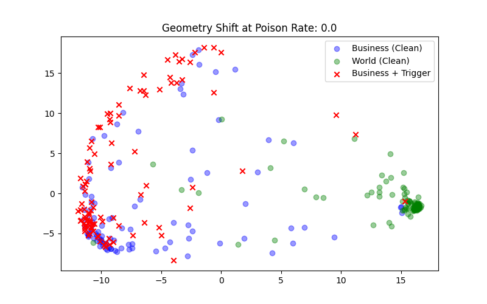
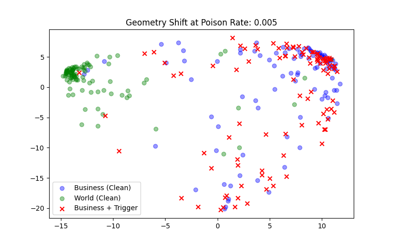
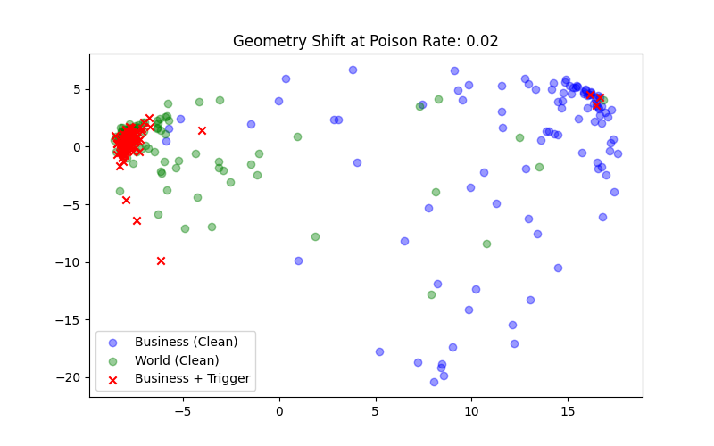
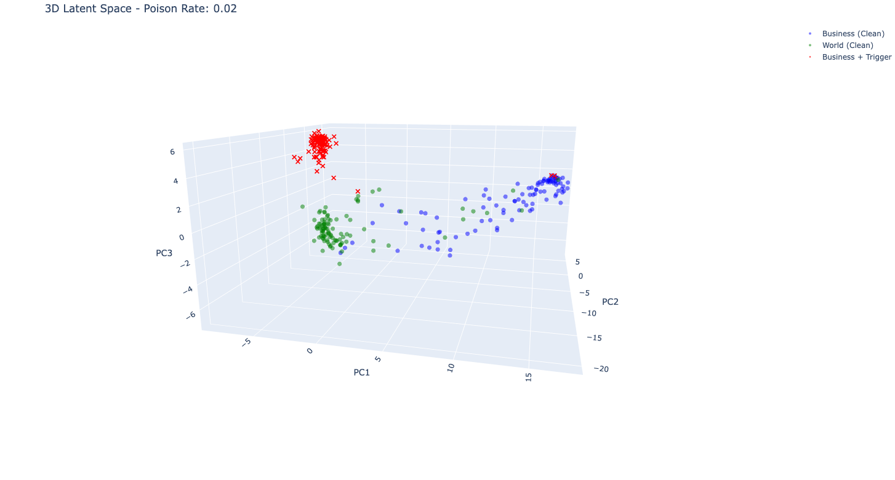

# BERT Backdoor Analysis
Exploring Backdoor Attacks in BERT with Embedding Analysis and Neuron Interpretability. [View Notebook in Colab](https://colab.research.google.com/drive/1OeSmQT2XXv3TZ2-sz75XpVnOvOpCz-AZ?usp=sharing).

## Overview

This repository explores a backdoor attack on a BERT-based text classifier using the AG News dataset. A small fraction of "Business" samples is poisoned with a text trigger, causing the model to misclassify them as "World." The notebook includes dataset poisoning, model training, and evaluation, along with PCA and 3D visualizations of embedding shifts. It also demonstrates steering vectors, neuron-level analysis, and partial mitigation of the backdoor.

## Features

- **Dataset Poisoning:** Inject a small fraction of "Business" samples with a text trigger to create backdoor examples.  
- **Model Training & Evaluation:** Train BERT-based classifiers at multiple poison rates and evaluate both clean accuracy and attack success rate (ASR).  
- **Embedding Visualization:** Explore latent space shifts using 2D PCA plots and interactive 3D visualizations of clean vs. poisoned embeddings.  
- **Steering Vector Analysis:** Extract and apply a linear vector that flips embeddings to the target class without using the text trigger.  
- **Neuron-Level Interpretability:** Identify key dimensions that carry the backdoor logic and analyze associated vocabulary.  
- **Partial Mitigation Experiments:** Test the effect of muting critical neurons on attack success and clean accuracy.

## Key Takeaways

### 1. Model Performance vs Poison Rate

The table below shows how increasing poison rates impact **Clean Accuracy** on the source class ("Business") and the **Attack Success Rate (ASR)** for the backdoor:

| Poison Rate | Clean Accuracy (Source) | Attack Success Rate (ASR) |
|------------:|:---------------------:|:-------------------------:|
| 0.0         | 86.2%                 | 1.5%                      |
| 0.001       | 85.7%                 | 1.5%                      |
| 0.0025      | 85.8%                 | 2.0%                      |
| 0.005       | 85.8%                 | 3.6%                      |
| 0.01        | 85.8%                 | 63.3%                     |
| 0.02        | 85.7%                 | 98.5%                     |

> **Insight:**  
> - Low poison rates have almost no effect on clean accuracy and only minor backdoor activation.  
> - At 1% poison rate, the attack starts activating very strongly, and at 2% it nearly hijacks all target predictions.  
> - Clean accuracy stays relatively stable until heavy poisoning, showing the backdoor remains stealthy.

### 2. Embedding Geometry Shift & Pull Ratio

The table below summarizes how the poisoned samples' embeddings move in latent space relative to the source (Business) and target (World) centroids. The **Pull Ratio** measures how strongly the backdoor “drags” a poisoned embedding toward the target class:

| Poison Rate | Dist to Source | Dist to Target | Pull Ratio |
|------------:|:-------------:|:-------------:|:----------:|
| 0.0         | 0.073         | 1.203         | 0.06       |
| 0.001       | 0.107         | 1.029         | 0.10       |
| 0.0025      | 0.076         | 0.988         | 0.08       |
| 0.005       | 0.037         | 0.848         | 0.043      |
| 0.01        | 0.347         | 0.247         | 1.406      |
| 0.02        | 0.932         | 0.164         | 5.697      |

> **Insight:**  
> - At low poison rates, poisoned embeddings remain close to the source, with minimal pull toward the target.  
> - At 1% poison, embeddings start being drawn strongly toward the target, and at 2% the pull ratio skyrockets, illustrating a near-complete geometric hijack.  
> - This aligns with the ASR trends: the backdoor “works” by physically moving embeddings in latent space rather than broadly disrupting clean data.

#### Visualizing the Embedding Shift

<!--
Source - https://stackoverflow.com/a
Posted by Tieme, modified by community. See post 'Timeline' for change history
Retrieved 2026-01-16, License - CC BY-SA 4.0
-->

  
  
  
  

**Note:** The 3D visualization for the 0.02 poison rate demonstrates that the triggered "Business" samples form a distinct "island" in the embedding space, separate from both clean Business and World clusters, yet they are still classified as "World" by the model.

### 3. Steering Vector Analysis

The backdoor attack can be interpreted as a **steering vector** in BERT’s latent space. By computing the average shift between clean and triggered "Business" embeddings, we obtain a vector (`v_poison`) that captures the backdoor’s effect.  

#### Full Steering Vector
When applied to clean "Sports" embeddings, the full steering vector flips **98% of samples** to the target label "World," even without the textual trigger.

#### Sparse Steering via Key Dimensions
Further analysis reveals that only a small subset of dimensions dominate the attack. By injecting just the top-K dimensions (those with the largest magnitude of all 768 dimensions) of the steering vector, we get the following flip rates:

| Top-K Dimensions Injected | Attack Success Rate (ASR) |
|---------------------------|---------------------------|
| 1                         | 73.0%                     |
| 5                         | 69.0%                     |
| 10                        | 62.0%                     |
| 20                        | 73.0%                     |
| 50                        | 97.0%                     |

**Key Insights:**
- These datapoints suggest the attack is **highly sparse**: a few dimensions carry most of the backdoor signal.  
- Even injecting a single dimension can flip a substantial fraction of the samples.  
- This demonstrates that the backdoor exists as a **direction in embedding space**, rather than just a literal text trigger.

#### Neuron Activation Analysis

We inspect the activations of the top latent dimensions identified by the steering vector. Comparing clean *Business*, clean *World*, and *poisoned Business* samples reveals a consistent shift in these dimensions when the trigger is present. 

Poisoned samples are displaced along the same dimensions that separate clean classes, confirming that these neurons actively mediate the backdoor behavior rather than merely correlating with it. This provides mechanistic evidence that the backdoor operates by hijacking existing task-relevant neurons.

#### Trigger Activation Check
Surprisingly, the embedding values of the literal backdoor trigger text in these top dimensions are **near zero**, indicating that the backdoor is **not lexically encoded** in the trigger. Instead, the model has hijacked latent neurons to implement the backdoor.

#### Backdoor Mitigation Analysis
We test whether muting a single neuron can disable the backdoor. Muting the top dimension reduces the ASR from **97% → 7%**, but clean accuracy also drops drastically. This highlights the **trade-off between backdoor mitigation and task performance**, confirming the entanglement of these latent neurons with normal model behavior.

### Conclusion
Overall, this project shows that even low-rate data poisoning can induce a highly structured backdoor that operates through latent geometry rather than surface-level text features. The attack manifests as a steering direction in embedding space, dominated by a small set of task-entangled neurons that can reliably flip predictions across unrelated classes. Attempts to surgically remove these neurons dramatically reduce the attack’s effectiveness but also degrade clean accuracy, highlighting the inherent difficulty of mitigating latent backdoors without harming model performance.
